> **2026-09-22 状态说明**：本文是通用控制架构比较与演进设想，不是当前部署清单。星载主控、纯集中资源下发、多层光交换等模式不能据此认定已在本平台实现。 当前机制见 [关键技术说明](../salasim_gmpls_backend/docs/current-platform-key-technologies.md)。

# 管控架构设计：统一架构集合

## 0. 设计说明

这份文档把之前分散讨论的内容整合成一组**统一的核心架构**，避免"控制关系"和"路由/信令机制"分散在不同小节里、需要来回对照。结构是：

- **第一部分**：4 种核心架构，每种都包含完整的四要素——控制器关系、路由机制（含链路状态同步）、信令模式、优缺点。这是全文的主体，其它部分都是围绕这 4 种架构的补充配置维度。
- **第二部分**：部署位置维度——控制器（Parent/Domain PCE）该物理部署在哪、多大范围内自治，这是一个可以应用到架构二/三/四之上的独立谱系，不是第 5 种架构。
- **第三部分**：技术域适配——当目标网络是 OTN 而不是通用 GMPLS/卫星网络时，路由机制需要额外考虑的因素（分层复用、时隙连续性、保护倒换），附带域间/跨层这个额外的扩展维度。
- **第四部分**：韧性叠加机制——数据面自愈层、预置式日历调度，可以叠加在任意架构之上。
- **第五部分**：算法/协议工具箱——8 个可以嵌入任意架构的具体算法/信令设计。
- **第六部分**：三轴分析框架——泛洪机制、算路单元、信令模式，用来给前面 4 种架构定位，也可以脱离这 4 种自由组合。

### 架构总览表

| 架构 | 控制关系核心 | 谁算路 | 信令 | 适用场景 |
|---|---|---|---|---|
| **架构一：全分布式** | 无中心，节点对等 | 网元本地（可选叠加 PCE 仅做复杂请求协助） | 逐跳分布式（RSVP-TE） | 单一管理域，追求最高健壮性 |
| **架构二：H-PCE + 并行拼接** | Parent + Domain 两级 | Domain PCE 域内算，Parent 域间拼接（无代价反馈） | 三层 PCEP 级联 | 多域，追求实现简单、时延最低 |
| **架构三：H-PCE + 反向递归 BRPC** | 同架构二 | 同架构二，但域间代价感知（RFC 5441） | 同架构二，反向递归时序 | 多域，追求跨域路径质量 |
| **架构四：H-PCE + 有状态集中资源分配** | Parent 持有全局资源账本（Domain 层级可以收缩为 0，退化成单点） | Parent 统一做路由+资源联合分配，域/节点是纯执行者 | PCEP 有状态/PCInitiate，或 NETCONF 直接下发 | 需要全网资源强一致、确定性重路由 |

四种架构之间是一条能力递进的谱系（架构一到架构四，中心化程度和路径/资源质量依次提高，节点自主权和健壮性依次降低），不是互斥的平行选项——具体选哪个取决于对"联合优化质量"和"去中心化健壮性"这对矛盾的取舍。

---

# 第一部分：四种核心架构

## H-PCE 基础架构（架构二/三/四共用的骨架，先讲清楚再看变体）

架构二、三、四都是**层次化 PCE（Hierarchical PCE，H-PCE，RFC 6805）**的具体变体，在看它们的差异之前，先把这个共同骨架讲清楚——H-PCE 本身要解决的问题、基本结构、基本工作流程分别是什么。

**要解决的问题**：单一 PCE（架构一，即使叠加旁路 PCE 协助）只适用于一个管理域内——一旦网络跨越多个管理域（不同运营商、不同地理区域、不同厂商设备域），没有人愿意把自己域内的完整拓扑暴露给一个外部/上级 PCE，同时单个 PCE 持有全网 TED 在规模上也不现实。H-PCE 用"分层 + 域内信息隐藏"来解决这两个问题。

**基本结构**：

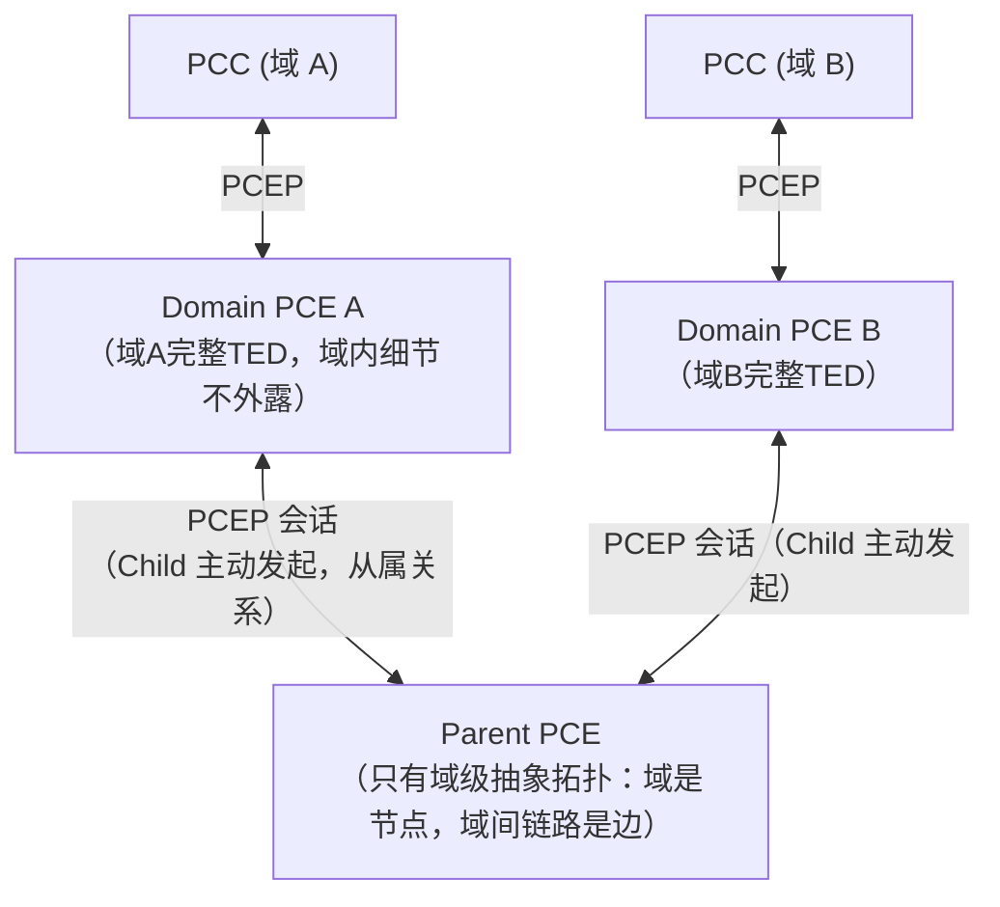

- **两级 PCE，一级信息隐藏**：每个管理域内部署一个 Domain（Child）PCE，持有本域完整 TED（拓扑、资源占用，细节和架构一里的单域 PCE 一样）；再往上有一个 Parent PCE，**只**持有域级抽象拓扑——域被抽象成一个节点，域间链路是边，域内是什么样子 Parent 完全看不到。这就是"信息隐藏"：Parent 知道"域 A 和域 B 之间有一条链路"，但不知道域 A 内部具体怎么组网。
- **从属关系，不是对等关系**：Child 是从属方，主动向 Parent 建立 PCEP 会话并保持连接；Parent 只被动接受，不会反过来主动连 Child。这一点是 H-PCE 和"架构三设计里提到但没采用的对等式联邦 PCE"（RFC 5152，域与域直接对等协商，没有 Parent）的本质区别——H-PCE 明确有一个层级更高的协调点。
- **域是什么**：可以是一个 IGP 区域、一个自治系统、一个厂商设备域，或者纯粹按地理/管理边界划分，H-PCE 架构本身不规定"域"具体怎么划，只要求划分之后每个域有自己的 Domain PCE。

**基本工作流程**（不涉及"Parent 具体怎么决定域间怎么走"这个细节——那是架构二/三/四的分歧点，这里只讲流程骨架）：

1. 业务请求送到源端点所在域的 Domain PCE，或者由上层业务系统直接判断"这是不是一个跨域请求"。
2. 如果源、宿在同一个域，Domain PCE 直接按架构一的方式本地算路，Parent 完全不参与——这是 H-PCE 里的"同域捷径"，任何一个变体都一样。
3. 如果跨域，请求（或者关于"这是跨域请求"的判断）交给 Parent。Parent 在它持有的域级抽象图上确定这条业务要经过哪些域（域序列），然后协调对应的 Domain PCE 分别算出各自域内那一段的路径。
4. 各域内段拼接成一条完整的端到端路径。
5. 域内的实际建路信令（PCInitiate/RSVP-TE）由各 Domain PCE 自主向自己域内的 PCC 发起，Parent 不直接接触任何 PCC。

**这个骨架里唯一没讲清楚、留给架构二/三/四分别回答的问题**：第 3 步"Parent 怎么确定域间怎么走、算不算代价、要不要管资源分配"——这才是三个变体真正的差异所在，下面分别展开。

### 骨架层面已经确定的四件事（不随三个变体变化）、以及一件没确定的事

**路由泛洪**：这里要先纠正一个容易想当然的假设——**域内网元（PCC）之间互相泛洪，其实不是 H-PCE 骨架本身要求的，是从架构一继承过来的一个可选传统做法，不是必须的**。原因很直接：泛洪的目的是让每个参与计算的节点都拿到一致的拓扑视图去算路；H-PCE 下域内路径计算权已经完全交给 Domain PCE，网元自己不算路，也就不需要"和其它网元保持一致视图"这件事本身的存在理由。所以域内实际上有两种同样成立的做法：
- **做法 A（沿用架构一的传统）**：网元之间依然跑标准 IGP-TE 互相泛洪，各自维护一份本域一致视图，Domain PCE 作为旁路监听者被动收集这份泛洪流量来重建 TED。选这个通常是因为网元本来就是运行标准路由协议的通用设备（兼容性/复用现成实现），或者网元除了执行 PCE 算好的路径外还需要本地拓扑感知做别的事（比如本地保护倒换要知道邻居状态）。
- **做法 B（更贴合 H-PCE"计算权集中"这个精神）**：网元之间**不需要**互相交换拓扑信息，每个网元只需要知道"我自己这条本地链路的状态"，点对点上报给 Domain PCE，不用管其它网元的状态。Domain PCE 把所有网元报上来的碎片信息拼成一份完整域内 TED 再去算路——这是"广播泛洪"变成"星型汇聚"的又一个实例，和后面架构四"网元不需要泛洪"是同一个道理，只是在基础骨架这一层就已经是一个开放选项，不需要等到选了架构四才成立。

**这里必须把"拓扑泛洪"和"LSP 建路信令"分清楚**——不管域内选做法 A 还是 B，**LSP 实际建立时网元之间依然要直接交换 RSVP-TE PATH/RESV（以及拆路时的 PathTear/ResvTear）消息**，这是沿着 Domain PCE 算好的具体 ERO、逐跳定向传递给路径上的下一跳，只发生在这条 LSP 真正经过的相邻两跳之间，不是广播、不涉及"和其它所有网元交换"，也不算"泛洪"。这件事是骨架层面就要求的（域内建路信令由网元自主完成），不受"拓扑发现要不要泛洪"这个选择影响——即使域内彻底不用 IGP-TE 泛洪（做法 B），LSP 建路时相邻网元之间的 RSVP-TE 信令依然照常发生。

域间（Parent 需要的域级拓扑信息）**不能**用广播式泛洪——H-PCE 存在的理由就是域间信息隐藏，让域间互相泛洪等于把每个域的存在意义抹掉了；域间固定走 Child 域向 Parent 的**点对点周期性上报**（拓扑通告，BGP-LS 或 PCEP 扩展 TLV 都行），这是骨架层面就定了的，不是变体的分歧点。

**路径计算**：域内固定由各 Domain PCE 本地算（标准 CSPF/RWA/RSA），骨架层面已定。域间固定由 Parent 算（骨架层面已定"归 Parent 管"这件事本身），但"具体怎么算"——比不比代价、管不管资源——骨架不回答，这才是三个变体真正要回答的问题。

**信令机制**：域内 PCC 与 Domain PCE 之间、域间 Domain PCE 与 Parent 之间，骨架层面都固定要求走 **PCEP**（这是 H-PCE 作为一个"PCE"架构的基本前提，不用 PCEP 就不是 H-PCE 了）。但 PCEP 上承载什么**语义**——无状态 PCReq/PCRep 并行、还是反向递归携带代价/VSPT、还是有状态 PCInitiate/PCRpt——骨架不规定，是三个变体的分歧点。

**LSP 谁来管理**——这是骨架层面**真正留白、没有默认答案**的一件事，值得单独说清楚：
- 域内这一段：不管选哪个变体，各 Domain PCE 都可以（通常也应该）用标准 PCEP 有状态 LSP-DB（RFC 8231）管理自己域内那一段的状态，这是纯域内实现细节，和"H-PCE 要不要分层"无关。
- **跨域这条完整 LSP**：H-PCE 骨架本身**不强制** Parent 维护一个"这条端到端 LSP 由哪几段组成"的账本。如果 Parent 保持无状态（架构二/三），那么骨架层面**没有任何一方**持久化保管这条跨域 LSP 的构成信息——建路时返回给上层业务系统的 ERO/句柄，就是这条 LSP 唯一的"身份证"，后续要查询、要拆除，必须由**发起请求的上层业务系统自己记住并原样带回来**，Parent 不负责、也没有能力主动追踪。只有往架构四方向走（引入账本），Parent 才从"路径计算的临时服务"变成这条跨域 LSP 的权威管理者，能反过来主动发起 PCUpd、响应查询、追踪全生命周期状态。

一句话总结这五件事：**域内算路权归 Domain PCE、域间归 Parent 管、域间不能泛洪只能点对点上报、必须用 PCEP 这几件事，是骨架层面已经钉死的；域内网元之间要不要真的互相泛洪（做法 A/B）只是一个开放但不影响正确性的实现选择；域间具体怎么算、PCEP 承载什么语义、这条跨域 LSP 到底有没有人集中管，是留给三个变体分别回答的部分——默认（不主动选架构四）的答案是"没有人集中管，上层业务系统自己兜着"。**

## 1. 架构一：全分布式（无 PCE，ASON/GMPLS 经典模型）

### 控制器关系

每个网元内嵌完整的控制平面功能（呼叫控制 + 连接控制，ITU-T G.8080 ASON 架构的直接体现），网元之间对等，没有任何集中节点。

### 路由机制（含链路状态同步）

每个网元通过 IGP-TE（OSPF-TE 或 ISIS-TE，OTN 场景用其扩展 RFC 7580）持续泛洪自己的链路属性（带宽、时延、可用波长/频谱/时隙位图、SRLG 归属等），本地维护一份全网 TED；源网元收到业务请求后本地跑约束最短路径算法（CSPF/RWA/RSA，看交换技术而定），如果要求保护，同时算出一对 SRLG 不相交的工作/保护路径。

**可选变体：叠加 PCE 做复杂请求协助计算（RFC 4655 经典模型）**——不替换任何现有机制，网元依然是完整的分布式节点，只是遇到自己算不好或不想算的请求（比如需要 SRLG 不相交双路径、多约束联合优化、跨多个并发请求做全局负载均衡）时，作为 PCC 把请求发给一个旁路部署的 PCE，PCE 算完把显式路径（ERO）返回，网元拿到 ERO 后依然自己发起分布式信令建路——PCE 只参与"算"，不参与"建"，简单请求可以完全绕开 PCE。这个变体让架构一在"要不要引入一点集中计算能力"这件事上留有余地，而不需要跳到架构二/三/四那种带层级的模型。

### 信令模式

**泛洪机制**：IGP-TE（OSPF-TE/ISIS-TE）全网泛洪，见上面"路由机制"——这既是链路状态同步的手段，也是每个网元维护本地 TED 的唯一数据来源，架构一里没有第二条通道。

**谁计算路由**：源网元本地计算（叠加 PCE 变体时，复杂请求由旁路 PCE 计算，但发起建路信令的还是源网元自己，PCE 不直接下发）。

**建路**：源网元算完路径后，用 RSVP-TE 沿路径逐跳发 PATH 消息，每一跳网元根据携带的标签信息配置本地交叉连接并确认，直到目的网元，再逐跳回 RESV 确认预留生效。整个过程没有任何 PCEP 或第三方控制器介入（即使叠加了 PCE 协助变体，PCE 也只返回 ERO，不参与逐跳信令）。

**拆路**：源网元（或任意一端）发起 RSVP-TE PathTear 消息沿路径逐跳传递，每一跳网元收到后立即释放本地占用的资源（标签、时隙、带宽）并转发给下一跳，下游用 ResvTear 反向确认；如果链路走的是软状态（周期性 Refresh 维持，见第五部分"软状态信令"），也可以不发显式 PathTear，停止刷新、等状态自然超时过期，代价是资源释放会有一个刷新周期的延迟。

### 优缺点

- 优点：没有任何单点，任意网元故障只影响它自己承载的业务，架构最健壮；技术成熟，是电信级网络几十年的实践基础；PCE 协助变体可以低成本、渐进式地引入集中计算能力。
- 缺点：每个网元各自独立算路，缺乏全局视角，多约束联合优化、跨请求的全局最优做不到；IGP-TE 全网泛洪在网络规模变大、状态变化频繁时开销上升；算法能力受限于单节点实现，统一策略升级需要逐节点推送（叠加 PCE 变体后，复杂场景的联合优化能力有改善，但简单场景仍是纯分布式）。

## 2. 架构二：H-PCE + 并行拼接（无状态、无代价反馈）

### 控制器关系

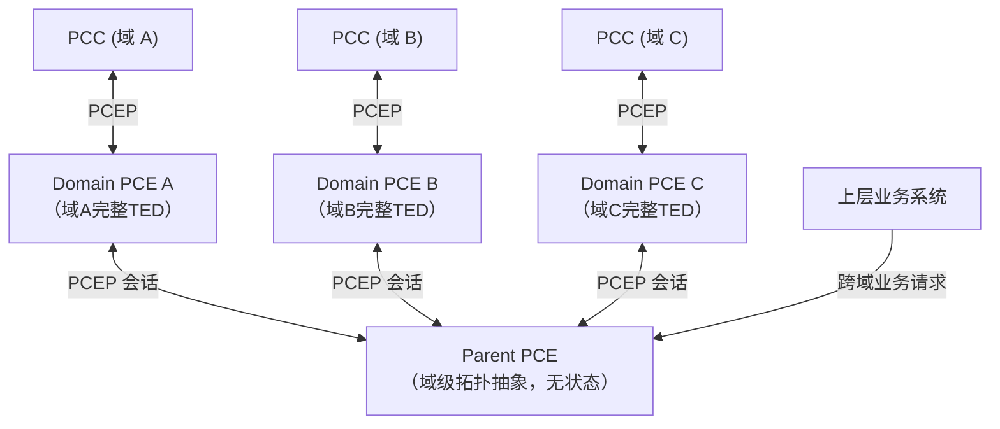

层次化 Parent/Child H-PCE（RFC 6805）：Parent PCE 只持有域级抽象拓扑（域是节点、域间链路是边，域内细节隐藏），每个 Child（Domain）PCE 持有自己域内完整 TED，Child 主动向 Parent 建立 PCEP 会话并保持从属关系。这张控制关系图是架构二/三/四共用的骨架，三者的差异只在 Parent 内部的路由决策逻辑和状态化程度。

### 路由机制

Parent 在域级图上跑域间最短路/K 最短路算法，按跳数（或简单的静态域间权重）选出一条候选域序列，把跨域路径拆成每个域一段，**并行**下发给对应 Domain PCE 独立计算，域内各自返回可行 ERO 后直接拼接。只要选中的候选域序列里每一段都算出可行路径就采用——**不比较总代价，也不去看其它候选**。域内计算本身是标准约束最短路（CSPF/RWA/RSA）。

**谁计算路由**：域内段由对应 Domain PCE 各自计算；域序列（走哪几个域）由 Parent 计算；没有任何一方单独持有端到端完整路径的计算权——是"Parent 定域序列 + Domain 各自定域内段"的分工。

**泛洪机制/链路状态同步**：域内沿用架构一的 IGP-TE 全网泛洪，Domain PCE 监听重建本域 TED，这一层和架构一完全一样，H-PCE 只是在这之上加了一层。域间不走泛洪——Parent 需要的域级拓扑信息很轻量，只是"哪些域相邻、通过哪个边界链路相连"这类静态或低频变化的拓扑关系，不需要实时资源占用信息。典型做法：每个 Child 域周期性（分钟级即可）**点对点上报**给 Parent（不是泛洪，可以是 BGP-LS，也可以是 PCEP 携带的拓扑通告消息），Parent 拿这份信息维护域级图。域内的资源占用完全由各 Domain PCE 自己管理，不上报给 Parent。

### 信令模式

**建路**：

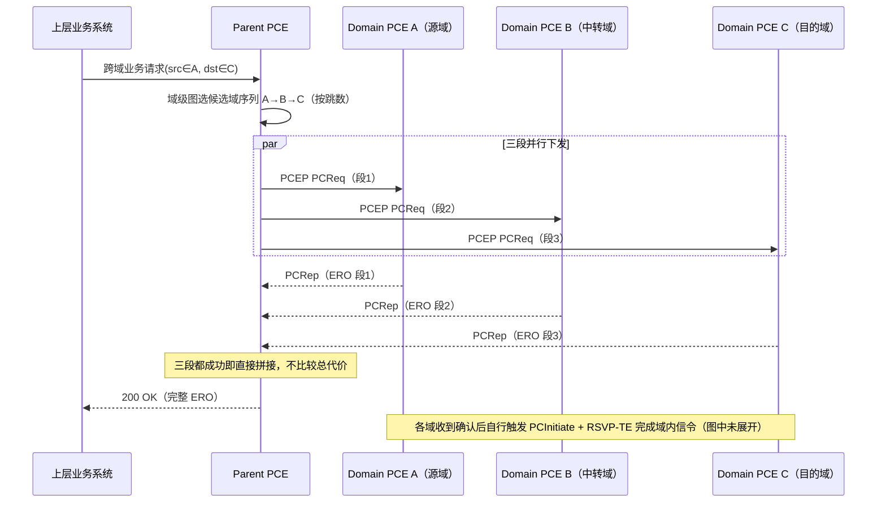

Parent 与 Child 之间基本是无状态的 PCReq/PCRep 往返，Parent 不持久跟踪每条跨域 LSP 的资源明细，域内信令（PCInitiate/RSVP-TE）由各 Domain PCE 自主完成。

**拆路**：因为 Parent 是无状态的，不持有"这条跨域 LSP 都经过哪些域"的账本，拆路请求必须**带上原来建路时返回的完整 ERO**（或等价的域序列+域内标识），Parent 才能知道要通知哪几个域。收到拆路请求后，Parent 按 ERO 反解出涉及的域，**并行**通知每个 Domain PCE 拆除自己那一段（域内走标准 RSVP-TE PathTear），不需要像建路那样考虑候选域序列——拆路没有"选哪条候选"这个问题，直接按已经在用的那条路径通知即可。

### 优缺点

- 优点：实现最简单，跨域一次请求只需要一轮并行往返，时延最低；Parent 逻辑轻量，不需要维护跨域状态。
- 缺点：跨域路径质量没有保证——"选哪条候选域序列"只看跳数，即使跳数相同但实际代价差异很大的两条候选，也可能选到更差的那条；候选失败后除了换下一条候选重试，没有更细粒度的容错手段。

## 3. 架构三：H-PCE + 反向递归 BRPC（无状态、代价感知）

### 控制器关系

和架构二完全一样的层次结构，区别只在 Parent 内部的路由决策逻辑更复杂。

### 路由机制

Parent 依然在域级图上选出多条候选域序列，但**对每一条候选都做真正的反向递归计算**：从目的地一侧的域开始，让该域算出"从各个可能的入口边界节点到最终目的地"的代价（生成一棵虚拟最短路径树 VSPT），把 VSPT 回传给上一个（更靠近源的）域；上一个域结合收到的 VSPT 和自己域内从入口到各出口边界节点的代价，生成新的 VSPT 继续往上传，直到传回源域——源域拿到完整的端到端代价信息后选出最优的入口/出口组合。对所有候选域序列都做一遍这个过程后，**比较各自的总代价，选真正最优的一条**。

**具体例子**：源域 A、目的域 C 之间有两条候选域序列 A→B→C 和 A→D→C：

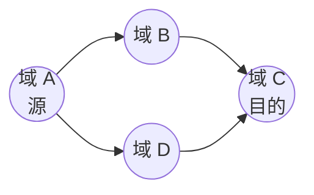

如果两条候选跳数相同（都是 2 跳），架构二可能因为"先算出来的候选先用"而选中总代价更高的一条；架构三会把两条都算完、比较总代价后正确选中更优的一条。这是架构三相对架构二的核心价值——用"多算一遍、比较代价"换取路径质量的确定性提升。

**谁计算路由**：和架构二一样是"Parent 定域序列 + Domain 各自定域内段"的分工，区别只在 Parent 这一侧多了"比较候选、选代价最优"这一步计算，域内计算本身没有变化。

**泛洪机制/链路状态同步**：域内同架构二，走 IGP-TE 全网泛洪；域间也同样是点对点上报（不是泛洪），只是 Parent 需要的域间信息多了一项——域内和域间链路除了拓扑关系，还需要携带**代价属性**（跳数、TE metric 或时延），否则反向递归比较代价这件事就没有意义。这项信息依然相对静态，可以和拓扑通告走同一条通道（BGP-LS 的 TE 属性字段，或 PCEP 拓扑通告消息里多带一个 metric 字段）。

**跨层变体（多层 PCE，适用于 OTN 等分层网络）**：如果网络本身是分层的（比如 OTN 的光层 OTU 和电层 ODU 由两个独立团队/系统管理），可以在"域"这个横向切分维度之外再引入"层"这个纵向切分维度——上层 PCE 负责客户层（如 ODU）的路由决策，下层 PCE 负责按需向上层供给服务层（如 OTU）的虚拟链路，两者可以和域的划分正交组合，具体展开见第三部分。

### 信令模式

**建路**：

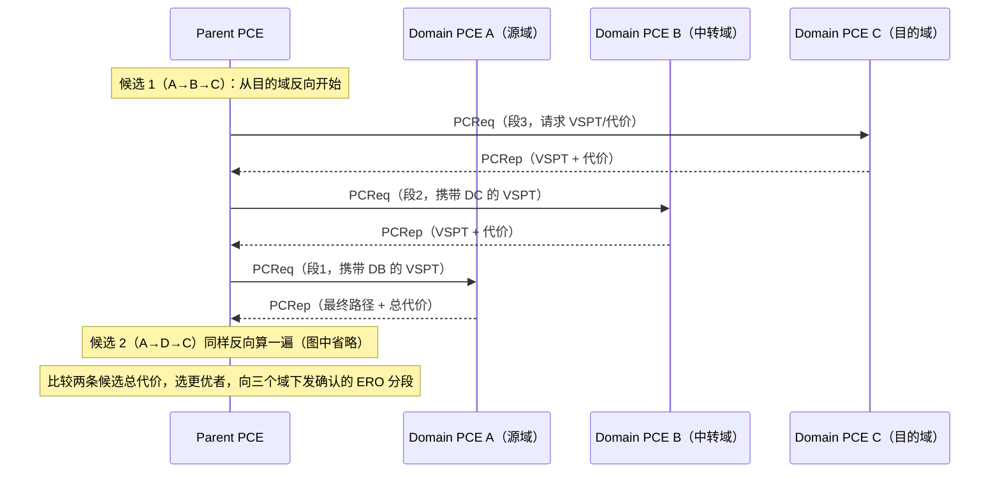

和架构二相比，消息类型不变（依然是 PCReq/PCRep），区别在于**调用顺序变成了严格反向、且携带代价/VSPT 信息**，Parent 需要为每条候选多做几轮往返（比架构二慢），换取路径质量的提升。域内信令（PCInitiate/RSVP-TE）依然由各域自主完成，和架构二相同。跨层变体下，层间信令是"客户层 PCE 向服务层 PCE 发起一个虚拟链路请求"，本质上也是一次 PCEP 请求。

**拆路**：和架构二完全一样——反向递归只是"决定走哪条路径"这个建路阶段的机制，一旦路径已经建成，拆路不需要重新走一遍反向递归比代价，Parent 直接按当初选中并记下的 ERO/域序列，并行通知涉及的各域拆除即可。跨层变体下如果拆除某条 ODU 业务导致它独占的 OTU 底层承载完全空闲，可以顺带触发一次"底层承载是否需要一并拆除"的判断，但这是可选的资源回收优化，不是拆路流程本身必须做的。

### 优缺点

- 优点：在"域序列决策"这一层做到了真正的全局最优（给定域序列候选集合的前提下），路径质量比架构二有实质提升；仍然不需要 Parent 维护跨域资源状态，复杂度增量可控；跨层变体能显著提升带宽利用率（按需触发新建底层承载，避免每条业务都独占一条底层容器）。
- 缺点：每条候选域序列都要走一次完整的反向递归，跨域建路时延比架构二高（尤其候选数量多、域跳数深的时候）；域内链路需要额外维护代价属性；跨层变体会让控制器关系变复杂（一个请求可能同时经历"域间转发"和"层间触发"两种协调）。

## 4. 架构四：H-PCE + 有状态集中资源分配（Stateful PCE-Initiated Centralized RSA）

### 控制器关系

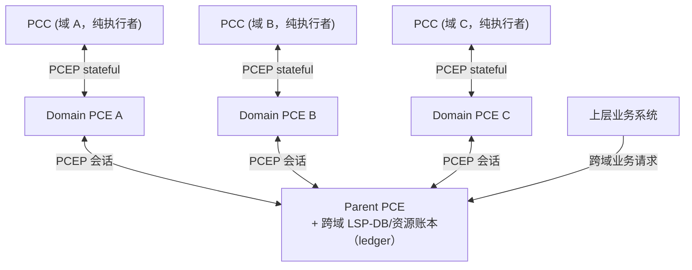

层次关系和架构二/三一样，但 Parent 内部多了一个持久化的**跨域资源账本**（记录每条跨域 LSP 实际占用了哪些具体资源：波长/频谱槽/带宽/ODU 时隙，而不只是走了哪条路径），这个账本才是全网资源占用的唯一权威来源。域 PCE 和 PCC 退化为"纯执行者"——不再自主决定资源分配，只负责按 Parent 下发的显式指令去配置数据面并确认。

**退化特例（Domain 层级收缩为 0）**：如果不划分任何 Child 域，Parent 直接面对所有网元，这个架构就退化成一个纯粹的单点集中控制——全网只有一个持有资源账本的控制中心，直接做全局路由+资源联合分配、直接下发到每个网元，没有中间的域层级。这是"控制中心天然就是唯一权威"场景下最自然的形态（比如控制中心本身就打算做全局联合优化，多一层域划分反而是不必要的中间层）。

### 路由机制

与架构三一样先做域序列选择 + 反向递归确定路径（如果有域层级的话；退化特例下直接在全网图上做），但多了关键的一步：Parent 不是"问域内还有没有可行路径"，而是**基于账本实时投影出的有效 TED（Effective TED = 原始拓扑 − 账本里所有活跃 LSP 占用的资源）**来做路由和资源分配的联合决策（RWA/RSA/OTN 场景下的时隙联合分配），决策结果是一组**显式资源标签**，而不是一条抽象路径。域内 PCE（如果存在）不再自己跑独立的资源分配算法，只是把 Parent 已经分配好的显式标签落到本域的 ERO 上。

**谁计算路由**：Parent 一家独大——路由和资源分配是一个联合决策，不再拆成"Parent 定域序列 + Domain 定域内段"两个独立计算，Domain PCE（如果存在）不做任何路由/资源计算，只做"把 Parent 给的显式标签落地"这一件事。

**泛洪机制/链路状态同步**：这是和架构二/三本质的区别，也是这个架构里"泛洪"这个词基本不适用的地方——架构二/三域内还保留标准 IGP-TE 泛洪（Domain PCE 自己维护一份域内 TED 备用），架构四里域内是否还需要泛洪取决于 Domain PCE 是否还承担任何独立决策：如果 Domain PCE 已经完全退化成"标签落地执行者"，域内可以**不再泛洪**，网元直接把链路状态点对点上报给 Domain PCE/Parent（更接近"遥测"而不是"路由协议"）；即使保留域内泛洪作为冗余观测手段，真正驱动路由决策的也不是这份泛洪视图，而是 Parent 的账本。核心机制是：每一次 LSP 建立/拆除/重路由，域 PCE（或网元）都要及时把"实际分配到了哪个资源"通过 PCRpt **点对点上报**给 Parent 更新账本；Parent 的有效 TED 完全由账本推导，不再独立地从各域"问一遍还有多少余量"。这比架构二/三的链路状态同步频繁得多、一致性要求也高得多——账本一旦和实际状态脱节，后续所有路由决策都会基于错误的资源视图。

### 信令模式

**建路**：

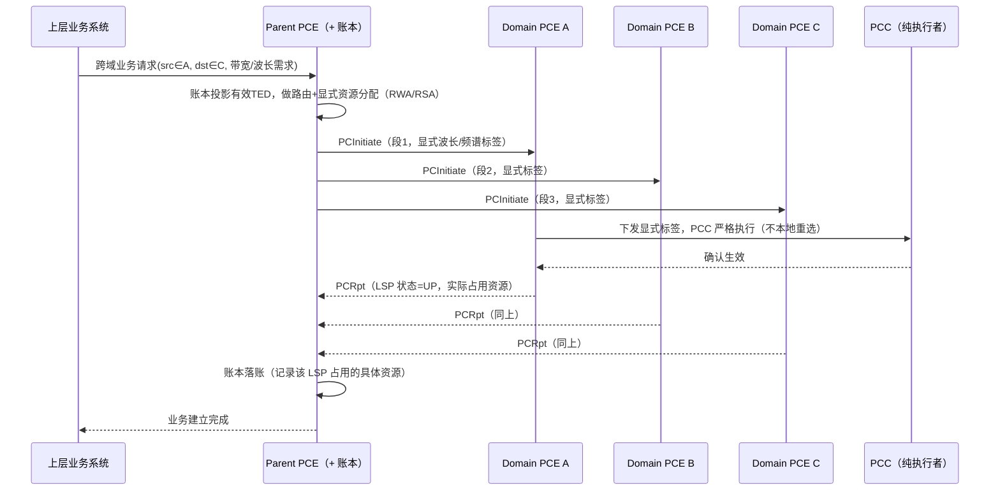

Parent-Child 之间的 PCEP 会话是完全有状态的（RFC 8231）且由 Parent 主动发起建路（RFC 8281 PCInitiate），域内不再有独立的 PCReq/PCRep 语义——一切由 Parent 显式下发、域执行、PCRpt 确认，形成一个紧耦合的状态机循环。退化特例（无域层级）下，PCInitiate 直接下发到网元，网元通过 PCRpt 或 telemetry 确认，也可以完全脱离 PCEP，改用 NETCONF/OpenConfig 直接编程交叉连接——两种选择本质相同，都是"集中下发"。

**拆路**：由 Parent 主动发起（RFC 8281 的 PCE-initiated 删除语义，PCInitiate 带删除标志/移除该 LSP 的关联），下发给涉及的每个 Domain PCE/网元，PCC 执行拆除并通过 PCRpt 回报"LSP 状态=DOWN"确认。**这一步唯一真正关键、且和架构二/三不同的地方是账本释放**：Parent 必须在收到全部拆除确认后，把这条 LSP 占用的显式资源（波长/频谱槽/时隙/带宽）从账本里正式释放，后续的有效 TED 计算才会把这些资源重新视为可用——如果某一段的 PCRpt 迟迟不返回（比如网元故障），Parent 需要一个超时/强制回收策略，否则账本会出现"资源已经物理释放，但账本还认为被占用"的假占用，导致后续路由决策系统性地低估可用资源。这个"拆路后账本必须正确释放"的要求，是架构四比架构二/三多出来的、拆路阶段特有的正确性负担（架构二/三因为本来就不维护账本，不存在这个问题）。

### 优缺点

- 优点：全网资源占用状态唯一、权威，不会出现"两个域各自以为某个资源空闲、结果冲突分配"这类不一致问题；可以做真正的全局资源优化；支持稳定性目标（尽量少扰动已有 LSP）这类需要全局资源视图才能做的策略；控制器可以直接对接运营支撑系统做业务自动化开通。
- 缺点：Parent 的账本是一个大型有状态系统，需要考虑持久化、高可用、跨进程重启的状态恢复，实现和运维复杂度最高；域/数据面完全失去自主权，任何本地资源变化都必须先上报 Parent、等 Parent 决策后才能执行；Parent 从"路径计算的协调者"变成了"全网资源的唯一决策者"，是最重的单点，一旦故障或状态不一致，恢复代价最高。

## 5. 四种架构对比

| 维度 | 架构一：全分布式 | 架构二：并行拼接 | 架构三：反向递归 BRPC | 架构四：有状态集中资源分配 |
|---|---|---|---|---|
| 控制器层级 | 无（可选旁路 PCE） | H-PCE（Parent + Domain） | 同架构二 | 同架构二（或退化为无域层级的单点） |
| 谁算路 | 网元本地（可选 PCE 协助复杂请求） | Domain PCE 域内 + Parent 域间拼接 | 同架构二，Parent 域间代价感知 | Parent 统一路由+资源联合分配 |
| Parent/中心是否有状态 | 不适用 | 无状态 | 无状态 | 有状态（跨域/全网资源账本） |
| 谁决定具体资源 | 网元自行决定 | 各域自行决定 | 各域自行决定 | Parent 统一决定，域/网元是执行者 |
| 链路状态同步/泛洪范围 | 全网 IGP-TE 泛洪 | 域内 IGP-TE 泛洪 + 域间点对点上报拓扑（低频） | 同架构二，域间点对点上报多带代价属性 | 域内可不泛洪（点对点上报/遥测）+ 域间 PCRpt 驱动账本（高频，强一致） |
| 信令语义 | 分布式逐跳（RSVP-TE） | 基本无状态 PCReq/PCRep | 同左，多了代价/VSPT 语义 | 完全有状态（RFC 8231）+ PCE 主动发起（RFC 8281） |
| 建路 | 逐跳 PATH/RESV | Parent 并行下发到域，域内 PCInitiate+RSVP-TE | 同架构二，域序列反向递归确定后再下发 | Parent 联合计算路由+资源，直接 PCInitiate 显式标签下发 |
| 拆路 | 逐跳 PathTear/ResvTear（或软状态超时） | Parent 按原 ERO 并行通知涉及域拆除，域内 PathTear | 同架构二（拆路不需要重新反向递归） | Parent 发起删除语义的 PCInitiate，收全部 PCRpt 确认后**必须释放账本资源**，否则出现假占用 |
| 路径最优性 | 单节点局部视角，无法联合优化 | 低（只看跳数，可能选错） | 高（给定候选集合下全局最优） | 最高（路径+资源联合最优） |
| 端到端建路时延 | 最低（无中心往返） | 最低（一轮并行） | 中（候选越多、跳数越深越慢） | 较高（账本更新+显式指令往返） |
| 数据面/节点自主权 | 最高 | 高（域自主执行） | 同左 | 无（纯执行者） |
| 单点故障 | 无（旁路 PCE 故障可退化） | Parent | 同左 | Parent（更重，因为还持有账本） |
| 实现/运维复杂度 | 最低 | 低 | 中 | 最高 |
| 适用场景 | 单一管理域、追求最高健壮性 | 多域，追求简单和低时延 | 多域，追求跨域路径质量 | 需要全网资源强一致、确定性重路由 |

## 6. 演进关系与选型建议

四种架构是一条自然的能力递进链条：架构一最健壮也最简单，缺乏全局视角；架构二引入层级后开始有跨域协调能力，但不比较代价；架构三补上代价感知，路径质量有保证；架构四进一步把资源分配也集中化、有状态化，换取全网资源强一致。工程上建议按实际需要的路径/资源质量和能接受的中心化程度倒推选型，不要一开始就上架构四——账本的持久化、一致性、高可用是相当重的工程投入，只有明确需要"全局资源唯一权威视图"时才值得；同样，如果连多域都不需要，架构一（必要时叠加旁路 PCE）往往是更简单、更健壮的选择。

---

# 第二部分：部署位置维度（架构二/三/四的通用配置谱系）

架构二/三/四共用同一个 Parent/Domain 层级，但都还隐含假设 Parent 和 Domain 之间的 PCEP 会话**随时可达**。在卫星网络这类控制中心（通常在地面）和被控对象（在天上）连通性本身不确定的场景下，"控制器物理部署在哪、多大范围内可以不依赖上级独立决策"是一个独立于路由决策方式的正交维度，值得单独展开成一条谱系，适用于架构二/三/四中的任何一个（下面用架构四举例，但整套谱系对架构二/三同样适用）。

针对卫星网络特有的三种压力——**规模**（星座节点数远超地面网络典型规模）、**不稳定性带来的并发业务中断**（轨道运动导致链路通断频繁且往往批量并发）、**地面失联**（部分卫星在特定时刻看不到任何地面站，这是卫星网络独有、地面网络不存在的问题）——这条谱系分五个梯度：

## 7. 梯度 0：纯集中式管控（架构四的退化特例，部署在地面）

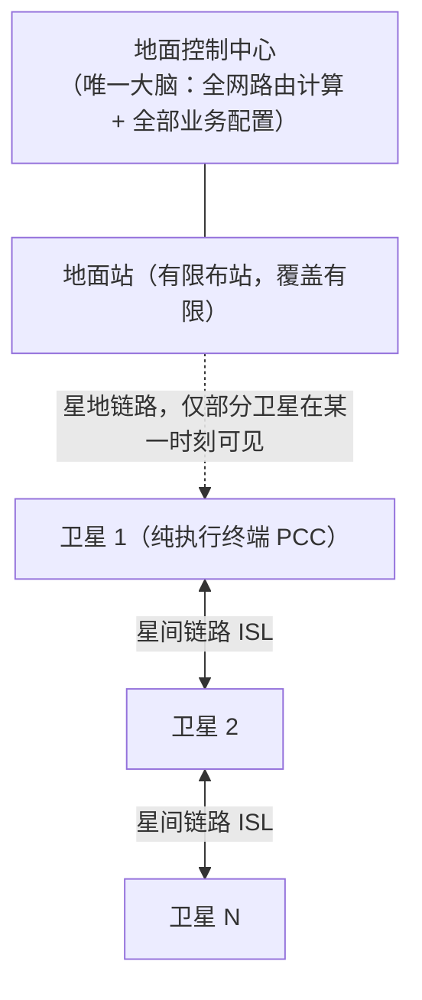

地面控制中心是唯一的大脑，对应架构四"退化特例"部署在地面的情形：持有全网 TED、做全部路由计算，直接下发每条业务配置。卫星是纯执行终端，没有本地决策能力。

**具体路由与信令**：用第六部分的三轴定位——泛洪=全集中收集（卫星直接上报地面，不互相泛洪）；算路单元=PCE 必经（地面唯一）；信令=集中下发（PCInitiate 或 NETCONF，指令通过 ISL 多跳转发到目标卫星，但每一跳只是转发，不做自主判断）。

**三种压力的具体表现**：规模上，全网 TED 随卫星数超线性增长，控制流量汇聚到有限地面站上行链路；并发中断上，每次链路失效都要走"卫星感知→转发到可见地面站→上行→重算→下行"的完整环路，大量并发失效会导致地面处理队列积压；地面失联上，看不见地面的卫星完全失去控制能力，这是架构上无法绕过的问题，不是加算力/加地面站能解决的，必须给星上留自主决策能力——这正是后面几个梯度要解决的。

## 8. 梯度 1：分层分域（引入架构二/三/四的 Domain 层级，缓解规模压力）

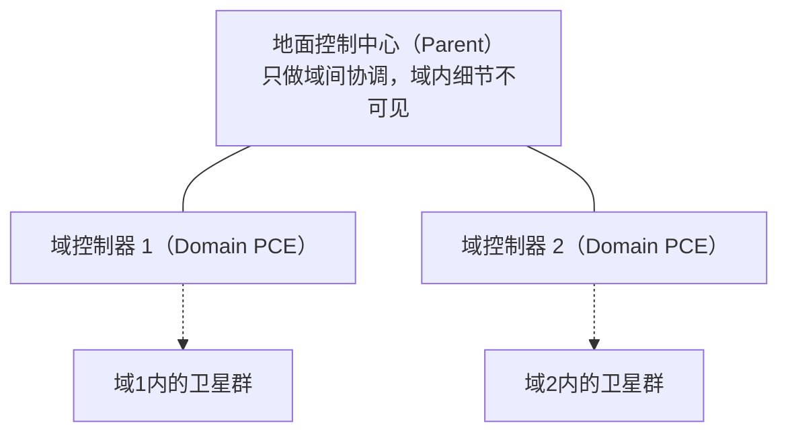

把星座按轨道面/轨道层/地理覆盖区域分域，每个域一个 Domain PCE（先部署在地面），Parent 退化成标准 H-PCE 角色。域内算路不变，域间路径决策就是第一部分架构二/三/四要回答的问题（推荐架构三的反向递归，规模变大后越需要真正比较代价）；链路状态同步变成域内泛洪+域间摘要；信令是三层 PCEP 级联。

**缓解了什么**：规模压力被有效分解——地面不再需要维护超大规模全网 TED，控制流量分流到多个域。**还没解决**：Domain PCE 仍在地面，域内卫星做决策依然要上行地面，并发中断和地面失联压力都还在。

## 9. 梯度 2：域内有界自治重路由（缓解并发中断压力）

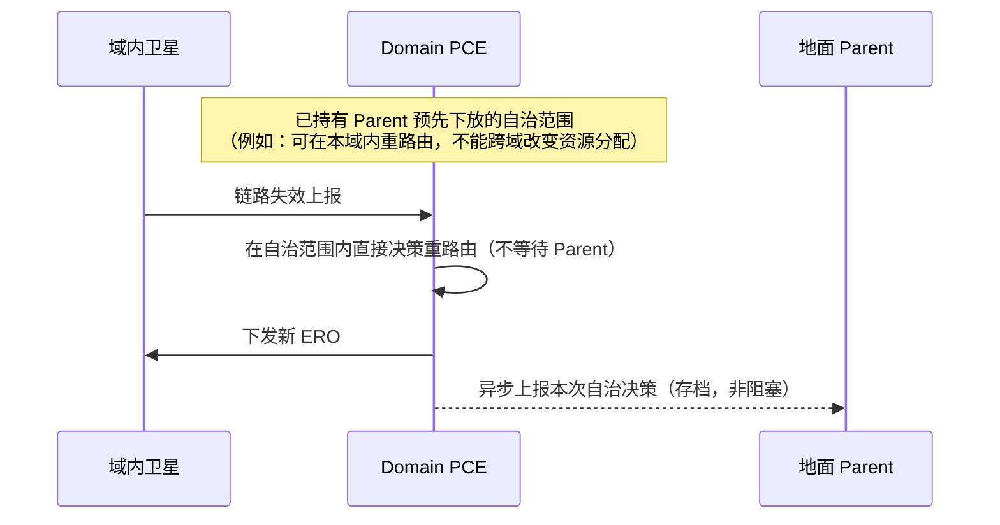

给每个 Domain PCE 下放有界自治权限（可以是"只允许域内重路由"，也可以是可消耗的资源信用额度），域内故障不必每次等 Parent 批准。**路由机制**：可以是受限 CSPF 现场重算，也可以直接用第五部分"本地快速重路由"——预先计算并预置好备份路径，故障时直接激活，进一步压缩恢复时延。**信令**：域内 PCC-DomainPCE 信令不变，新增的 Domain→Parent 上报用 PCEP Notification（单向、不阻塞），不用同步的 PCReq/PCRep 语义，避免自治决策被拖慢。

**缓解了什么**：并发中断压力显著缓解，恢复时延只取决于域内环路。**还没解决**：Domain PCE 若仍在地面，域内卫星和它之间仍要经过星地链路，地面失联压力没解决——决策权下放了，但决策者的物理位置没变。

## 10. 梯度 3：星载域控制器 + 断连自治与对账（缓解地面失联压力）

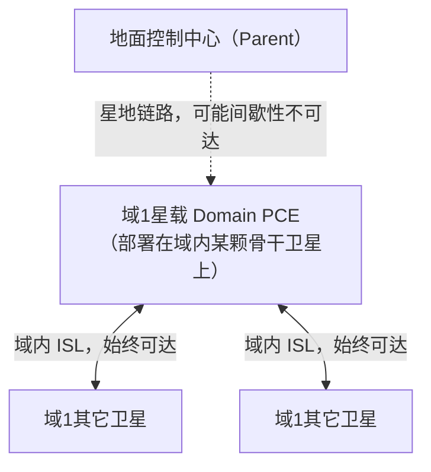

把 Domain PCE 从地面搬到天上——域内选一颗或若干颗骨干卫星作为星载控制器（固定指定或轻量选主，故障时重新选举）。因为星载 Domain PCE 和域内卫星都在轨、靠域内 ISL 连接，**只要域内 ISL 拓扑连通，星载 Domain PCE 就永远够得着域内所有卫星**，不依赖地面站可见性。

**路由机制**：域内算法和梯度 2 完全相同（标准 CSPF 或预置备份路径），只是运行位置搬到星载。真正新增的算法问题是断连恢复后的**状态合并**——用向量时钟或"时间戳+优先级"规则消解冲突。

**信令模式**：星地连通时是标准 PCEP 会话；断连期间，星载 Domain PCE 把每个自主决策打上时间戳/版本号本地留痕（对应第五部分"存储-携带-转发式信令"），恢复连接后**批量**上报增量（复用第五部分"批量信令"，避免逐条重发冲击刚恢复的星地链路），Parent 合并进全局账本，冲突时按预定义规则仲裁（典型策略：域内自治决策优先于地面同期的过期计划）。这一套"断连时自治 → 留痕 → 恢复后增量对账"的机制是一个通用模式，梯度 4 会展示它在更高一层的递归应用。

**缓解了什么**：地面失联压力在域内业务范围内被完全消除。**代价**：星载硬件要求更高（算力、存储、可靠性，骨干卫星故障需要选主/切换）；断连对账本身是一套需要仔细设计的分布式一致性机制；跨域业务在地面长时间失联期间仍会被推迟。

## 11. 梯度 4（进阶/可选）：多地面站 + 星载应急主控（应对 Parent 本身长期不可用）

如果不只是某个域暂时看不到地面，而是**唯一的地面控制中心本身**长时间不可用，梯度 3 还不够——跨域协调会一直停摆。这里是两个性质不同的机制：

**机制 A（新机制，冗余复制，不是自治）——多地面站互为备份**：部署多个地面控制中心，星载 Domain PCE 向"当前可见的任意一个"上报/请示，多个地面中心之间用标准分布式一致性协议（Raft/Paxos）同步账本——这是纯粹的多副本高可用问题，地面站间链路稳定，Parent 从始至终"在线"，只是切换了副本。

**机制 B（不是新机制，是梯度 3 同一个模式的递归应用）——星载临时应急主控**：某个星载节点检测到 Parent 长期不可达后，临时代行部分 Parent 职责，逻辑结构和梯度 3 完全一样（自治决策→留痕→恢复后增量上报、合并、仲裁），只是把"Domain PCE 相对 Parent 自治"这套原样搬到"临时应急主控相对真正 Parent 自治"这一层。真正新增的是这一层特有的两个问题：**谁来代行**（选主范围更大，可以用租约/心跳超时机制触发，Bully 或 Raft 式选主协商临时权威）、**代行范围要更保守**（只做保证业务不中断的最小调整，不做全局资源优化，降低恢复对账时的冲突概率，同时对账完成后需要一个明确的"权限交还"动作，避免出现两个权威同时生效的窗口期）。

两个机制可以组合：多地面站先把"Parent 本身不可用"的概率压低，星载应急主控是多地面站也扛不住时的最后一道兜底。这一步已经不完全是层次化 H-PCE 的范畴，而是往"部分自愈的网络"方向演进。

## 12. 部署位置谱系对比

| 维度 | 梯度0：纯集中式 | 梯度1：分层分域 | 梯度2：域内有界自治 | 梯度3：星载域控制器 | 梯度4：多地面站+星载应急 |
|---|---|---|---|---|---|
| 主要缓解的压力 | 无 | 规模 | 并发业务中断 | 地面失联 | Parent 本身长期不可用 |
| Domain PCE 物理位置 | 不存在 | 地面 | 地面 | 星上 | 星上 + 多地面站 |
| 域内故障重路由是否需上行地面 | 是（唯一路径） | 是 | 否（有界自治） | 否，不受地面可见性影响 | 同左 |
| 域间/跨域协调是否依赖地面可达 | 是 | 是 | 是 | 是（未解决） | 部分解决（多站备份+应急代行） |
| 工程复杂度增量 | 基线 | 中 | 中 | 高 | 最高 |

**选型建议**：按压力出现的顺序逐步推进，不要跳步——先用梯度 1 解决规模问题（这是第一部分架构二/三/四本身假设已经具备的前提）；观测到并发中断不可接受再引入梯度 2（对星载硬件没有新要求，可以先在地面 Domain PCE 上验证）；只有业务场景真正要求"部分卫星长时间看不到地面站时仍要保证域内业务不中断"，才值得投入梯度 3；梯度 4 只在"控制中心整体不可用"是需要认真对待的场景时才有必要。

---

# 第三部分：技术域适配——OTN 场景的路由机制补充

前两部分的架构对通用 GMPLS 网络（分组、WSON、SSON）和卫星网络都适用。当目标网络限定为 **OTN**（ITU-T G.709 光传送网）时，架构一/二/三/四的骨架不变，但路由机制需要补充几个 OTN 特有的考量点：

- **分层复用**：OTN 不是单层网络——光层 OTU（波长承载）之上是电层 ODU，ODU 之间还能逐级复用（若干 ODU0 复用进一个 ODU2，若干 ODU2 复用进一个 ODU4）。路由决策不只是选一条光路径，还要决定在哪一级 ODU 上做电层疏导（grooming），这正是架构三/四的"跨层变体"要处理的问题。
- **时隙连续性约束是局部的，不是端到端的**：ODU 业务在某段 OTUk 容器里占用若干时隙，这个约束只在"没有电层疏导"的区间内连续——经过疏导节点后业务被重新映射进另一个容器的时隙，约束在这里"重置"。这和纯光层的波长连续性约束（必须全程同一波长）有本质区别，路由算法需要区分哪些区间能疏导、哪些不能。
- **保护倒换是常规需求，不是特例**：电信级 OTN 普遍要求 1+1/1:1 保护或 SNCP、环网保护，路由算法经常要一次性算出一对 SRLG 不相交的路径，而不是只算一条最短路径——这一点在架构一/二/三/四的路由机制里都需要补充"同时算工作+保护路径"这个要求。
- **协议基础**：GMPLS 对 OTN 的扩展已经标准化——OSPF-TE 的 OTN 扩展（RFC 7580）负责链路状态分发（对应架构一的 IGP-TE 泛洪），RSVP-TE 的 OTN 扩展（RFC 7139，携带 ODU 标签、时隙分配信息）负责逐跳信令（对应架构一/二/三域内建路阶段）。

**四种架构在 OTN 场景下的具体形态**：

- **架构一（全分布式）在 OTN 下** = 经典 ASON 模型：每个 OTN 节点内嵌呼叫控制+连接控制，OSPF-TE(OTN) 泛洪 + 本地 CSPF（含保护路径对）+ RSVP-TE(OTN) 逐跳建路，是 OTN 控制平面的历史起点，几十年电信级实践基础；叠加 PCE 协助变体后，PCE 可以做单节点做不到的联合优化（比如统一处理一批并发请求、把疏导点选择也纳入统一搜索空间），但建路信令依然是节点自己发起的标准 RSVP-TE，未改变分布式本质。
- **架构二/三（H-PCE 并行拼接/反向递归）在 OTN 下** = 多域 H-PCE，域间机制不变（域序列选择+可选反向递归），域内计算换成 OTN 的约束最短路（含时隙/SRLG 约束）；如果同时存在光层/电层的独立管理需求，叠加架构三的跨层变体（多层 PCE，RFC 5623/6001 相关概念），域和层两个维度可以正交组合独立演进。
- **架构四（有状态集中资源分配）在 OTN 下** = 全集中式 SDN 管控：节点退化为纯交叉连接矩阵，不再运行 RSVP-TE（甚至可以不运行 OSPF-TE，链路状态直接上报控制器而不泛洪），Parent/中心控制器基于账本做路由+时隙/波长联合分配，用 PCInitiate（携带 RFC 7139 显式 ODU 标签）或 NETCONF/OpenConfig 直接下发交叉连接配置，节点通过 PCRpt/telemetry 确认。

**选型现状**：大多数电信级 OTN 网络今天的实际形态介于架构一（含 PCE 协助变体）之间——分布式控制平面为主，PCE 按需辅助复杂计算；只有真正出现多域/多层协同规划需求时才值得上架构二/三；架构四是"OTN 网络 SDN 化"的终态描述，通常只在希望把 OTN 完全纳入统一 SDN 编排、和其它层联合调度的场景下才整体值得投入。

---

# 第四部分：韧性叠加机制——把决策从"实时"前移到"更早"

第二部分应对三种压力的思路是"让控制面更自治/更靠近被控对象"；这里给一个正交的方向：**不在压力发生的那一刻做决策，而是提前把能确定的部分处理掉**，让压力发生时控制面需要做的实时决策尽量少。这两层机制可以叠加在前面任意一种架构（及其部署位置梯度）之上。

## 13. 机制一：数据面自愈层（零控制面依赖的第一道防线）

OTN 原生具备控制面完全不参与的硬件级保护倒换能力（线性 1+1/1:1、SNCP、环网保护，ITU-T G.873.1，倒换时间通常数十毫秒）——工作路径和保护路径建立时就预先双向配置好，故障时末端节点直接硬件层面切换，全程不需要任何控制器参与。

把这个能力提升为架构的**第 0 层**：所有业务建立时，控制面（不管选哪种架构）默认同时算并预先配置好一条 SRLG 不相交的保护路径；绝大多数瞬时/并发故障由数据面毫秒级自行吸收，不触达控制面，控制面只在保护路径也耗尽或需要主动重优化时才介入。

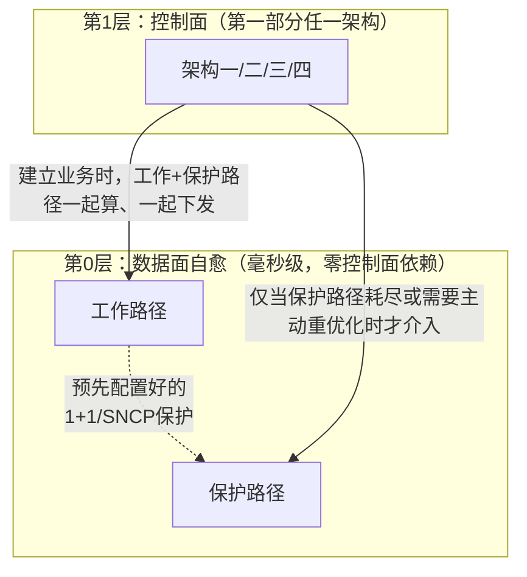

**对三种压力的效果**：规模压力上，控制面实时决策次数只和"新建业务数+保护路径耗尽重建数"相关，不再和"链路通断频率×节点数"相关；并发中断压力上，每条电路的硬件倒换独立并行，物理上不存在排队，是最彻底的解法；地面失联压力上，只要工作+保护路径物理资源没同时坏，业务在整个失联期间都能自愈，**和任何控制器是否可达完全无关**，比第二部分梯度 3 的星载域控制器更进一步（梯度 3 依然要求星载控制器本身正常工作）。

**代价**：保护路径是预先占用的资源，即使从未使用也一直消耗容量，是用资源利用率换生存能力的经典折中（可以用 1:N 模式降低冗余成本，代价是同时故障场景下保护成功率下降）。

## 14. 机制二：预置式日历调度（把可预测的变化提前处理掉）

机制一处理不可预测的故障；卫星网络还有大量**可预测**的拓扑变化（轨道运动导致的链路通断、可见性切换，本质是确定性的轨道力学问题）。控制面不需要等变化真正发生才开始算路，可以提前在空闲时段完成计算和预配置，变化发生时只是"激活"已经算好的方案。

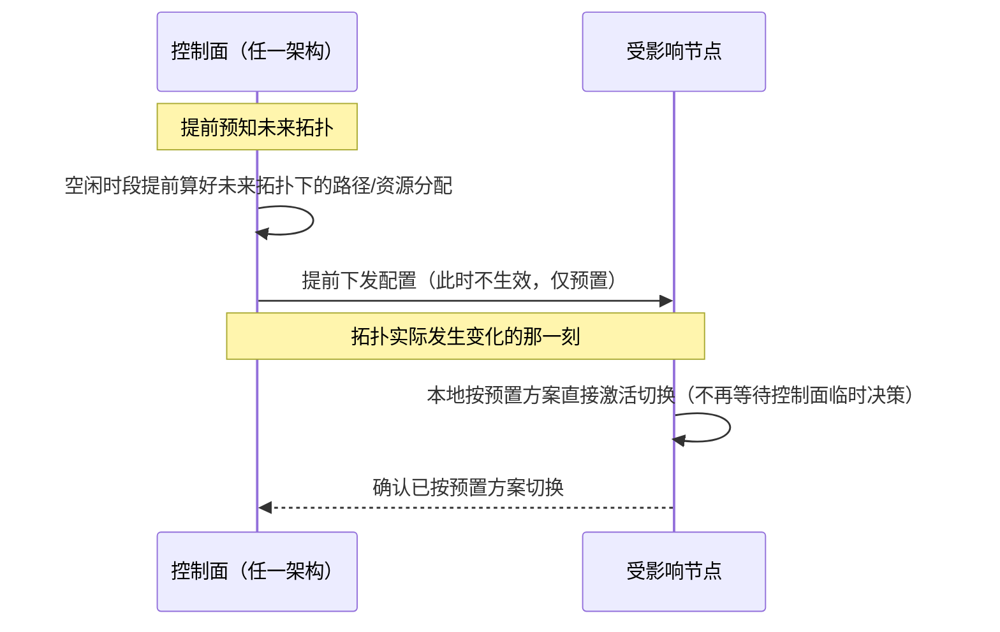

**对三种压力的效果**：规模压力上，把集中在"变化那一刻"的计算负载摊开到空闲时段完成；并发中断压力上，可预测变化造成的"并发"变成大量轻量的"激活"操作，不会造成处理拥塞；地面失联压力上，如果预置计算在失联窗口开始前就完成下发，失联期间的预期内变化可以完全自主激活——把"失联期间还能撑多久"从"看运气"变成"看预置计算覆盖了多远的未来"，是可以主动扩大的能力。

**代价**：要求控制面对未来拓扑有足够准确的预测能力（预测不准会退化到需要临时决策，回落到机制一/核心架构的兜底能力）；预置配置本身占用节点存储资源，覆盖的时间窗口越长，维护量越大。

机制一和机制二不是对前面架构的替代，而是叠加在其上的两层前移式补充，把"必须依赖控制面实时决策"的场景压缩到最小（真正意外、超出预置覆盖范围的情况），核心架构负责兜底这个被压缩后的剩余部分。

---

# 第五部分：算法/协议工具箱——可嵌入任意架构的具体设计

这里的 8 个设计都是算法/协议层面的具体机制，和前面"控制器摆哪、多自治、多有状态"是不同维度，可以自由嵌入第一部分四种架构中的任何一个。

## 15. 路由算法工具箱

- **契约图路由（Contact Graph Routing）**：借鉴 DTN（RFC 4838）思路，把拓扑建模成时空图（每条边标注存在的时间窗口），一次计算覆盖未来一整段轨道周期，不需要每次链路通断都重新触发计算。对规模压力：算路频率从"链路通断驱动"变成"契约计划更新驱动"，频率低得多；对地面失联压力：失联本身就是已知的"某条链路某时间窗口不存在"，算路时已经算进去，不需要额外应急逻辑。
- **增量式路由重计算**：拓扑变化只重算受影响的子树（动态最短路算法），不全网重跑。对规模压力：单次变化的计算成本从"和全网规模相关"降到"和受影响范围相关"；对并发中断压力：多个不重叠的并发变化可以独立并行处理。
- **多路径分散路由**：同时算 K 条 SRLG 不相交路径并同时分摊流量，而不是一条工作、其余热备。对并发中断压力：一次故障只影响分摊在那条路径上的部分流量，很多时候不需要触发新的信令。
- **分层聚合路由度量**：域间/跨层决策用聚合后的容量度量（比如域间总剩余带宽），不需要精确到每个资源单位，精确分配只在落地到具体链路时才本地精算。对规模压力：需要同步和计算的状态量从 O(链路数×资源粒度) 降到 O(域对数)。

## 16. 信令协议工具箱

- **本地快速重路由（Fast Reroute，RFC 4090 思路）**：为关键链路/节点预先计算并预先信令好本地绕行路径，故障检测点本地立即切换，不需要把故障一路信令回源节点或控制器。对并发中断压力：修复动作完全本地完成，天然并行不排队，恢复速度介于纯数据面 1+1（机制一）和完全依赖控制面重算之间。
- **软状态信令**：用周期性刷新维持状态而不是显式建立/拆除，短暂抖动不触发任何显式的拆除/重建流程。对不稳定性压力：把"值得触发重路由信令"的门槛从"任何一次失效"提高到"持续超过刷新周期的失效"，过滤掉大量转瞬即逝的抖动。
- **存储-携带-转发式控制信令（DTN 思路）**：给协议加一个"已接收，暂缓处理"状态，失联期间的请求被暂存而不是直接判超时失败，恢复后继续处理。对地面失联压力：把"控制面暂时不可达"从"请求失败"变成"请求排队"，减少不必要的重试/告警。
- **批量/聚合信令**：多个并发事件一次消息携带、一次性处理，减少协议交互次数本身的固定开销，还能做联合优化。对规模+并发中断压力：把"N 次独立交互的固定开销"降到"1 次交互的固定开销 + N 份数据"。

**选用建议**：主要担心规模，优先看契约图路由/分层聚合路由；主要担心并发中断，优先看多路径分散路由/本地快速重路由；主要担心地面失联，优先看契约图路由（已经把失联规划进算路）+存储转发式信令（兜底意外情况）。

---

# 第六部分：三轴分析框架——给所有架构定位

前面四种核心架构本质上是在三个最基础的控制平面设计问题上做了某种选择，这一部分把这三个问题拆解成三个独立的轴，用来给架构定位，也可以脱离这四种架构自由组合出新的点。

- **轴一：泛洪机制**——链路状态信息是全网/域内分布式泛洪，还是节点直接向一个集中点上报（不泛洪）？
- **轴二：算路单元**——路径是网元自己算，还是 PCE 集中算？
- **轴三：信令模式**——建路指令是逐跳分布式传递，还是控制器直接对每一跳集中下发？

## 17. 三个轴各自的选项与影响

| 轴 | 选项 | 规模压力 | 并发中断压力 | 地面失联压力 |
|---|---|---|---|---|
| **泛洪机制** | 全网/全域分布式泛洪 | 差 | 好 | 好 |
| | 节点直接上报、集中汇总，不泛洪 | 好 | 差 | 差 |
| | 域内泛洪 + 域间摘要（架构二/三/四用的就是这种） | 中 | 中 | 中 |
| **算路单元** | 网元本地 | 差 | 好 | 好 |
| | PCE 必经 | 好 | 差（除非叠加批量信令） | 差 |
| | PCE 优先、网元保留兜底（架构一的 PCE 协助变体） | 较好 | 较好 | 好（优雅降级） |
| **信令模式** | 逐跳分布式（架构一） | 中 | 好 | 好 |
| | 集中并行下发（架构四） | 好 | 看控制器处理能力 | 差（无退路） |
| | 混合：控制器算路，源节点发起逐跳信令（架构三的典型实现） | 中 | 好 | 较好 |

**关键发现**：三个轴往"集中"方向走通常对规模有利、对失联不利；往"分布式"方向走则相反——这不是"谁更先进"的问题，是三种压力互相拉扯的结果。三种压力往往并存，所以更合理的做法是**三个轴独立选中间的混合选项**，而不是笼统地全分布式或全集中。

## 18. 架构在三轴上的定位

| 架构 | 泛洪 | 算路单元 | 信令 |
|---|---|---|---|
| 架构一：全分布式 | 全网分布式泛洪 | 网元本地（可选 PCE 协助） | 逐跳分布式 |
| 架构二：并行拼接 | 域内泛洪+域间摘要 | 分域 PCE + Parent 拼接 | PCEP 级联（并行下发到域） |
| 架构三：反向递归 BRPC | 同架构二，域间多带代价属性 | 同架构二，Parent 做代价感知决策 | PCEP 级联（反向递归时序）|
| 架构四：有状态集中资源分配 | 集中收集（账本驱动） | PCE/中心必经 | 集中下发（PCInitiate/NETCONF）|

三个轴的极端选择（都选分布式=架构一，都选集中=架构四的信令+算路极端形态）分别对应两个"要么都好、要么都差"的端点。推荐的中间组合——域内泛洪+域间摘要、PCE 优先+网元兜底、控制器算路+源节点发起逐跳信令——本质上就是**架构三**已经在做的事：不是发明新东西，是明确指出架构三是这三个轴上经过深思熟虑的中间选择，三种压力同时存在时，两个极端都不是好答案。

## 19. H-PCE 域内的组合矩阵：域间路由决策 × 域间信令模式

H-PCE（架构二/三/四）的**域内**这一层是固定的，不参与组合——不管选哪个架构，域内都是标准 IGP-TE 泛洪 + CSPF/RWA/RSA 本地算路 + RSVP-TE 逐跳建路/拆路（架构四退化情形域内可能连泛洪都省了，见架构四"泛洪机制"一节，但域内算路和信令的基本形态不变）。真正有得选的是**域间**这一层——域间路径怎么决策、域间信令用什么语义，这两者不是完全独立的两个轴，因为路径决策方式本身对信令的调用顺序有约束：

| 域间路径决策 | 域间信令语义 | 是否成立 | 对应 |
|---|---|---|---|
| 并行拼接（无代价反馈） | 无状态并行 PCReq/PCRep | 成立 | **架构二** |
| 并行拼接（无代价反馈） | 有状态 PCInitiate + 资源账本 | 成立，但文档前面没单独命名 | 未命名混合：域序列决策依然简单（不比较代价），但资源分配要强一致——比如还没准备好上反向递归的计算成本，但已经需要账本避免资源冲突 |
| 反向递归 BRPC（代价感知，无联合资源分配） | 无状态反向 PCReq/PCRep | 成立 | **架构三** |
| 反向递归 BRPC + 联合资源分配 | 有状态 PCInitiate + 资源账本 | 成立 | **架构四**（架构四的路由机制本来就是"架构三的反向递归 + 联合资源分配"两者叠加） |
| 反向递归 BRPC（代价感知） | 无状态**并行**下发 | **不成立** | 反向递归要求从目的域开始严格按顺序逐域调用（后一域需要前一域回传的 VSPT），本质上是同步阻塞的调用链，没法用并行下发的信令语义承载——"代价感知"和"并行"这两个选择是互斥的 |
| 有状态联合资源分配 | 无状态 PCReq/PCRep | **不成立** | 资源分配一旦要写入账本，必须有 PCRpt 这类确认"实际占用了什么"的回执，无状态语义没有这个确认闭环，账本无从落账 |

四个"成立"的格子里，三个已经被提升成第一部分的命名架构，还剩一个**"并行拼接 + 有状态资源账本"**的组合没被单独展开——这是一个真实可行、只是介于架构二和架构四之间的过渡形态：域序列选择还是简单地看跳数、不做代价比较（继承架构二的低时延），但 Parent 已经开始维护资源账本、要求域用 PCRpt 确认实际占用（继承架构四的资源一致性），代价是"路径质量"和"资源一致性"这两个能力没有同步升级——如果确实只需要账本，不需要更好的路径质量，这个组合可以作为架构二到架构四之间的一个中间落地点，不需要一步到位。

两个"不成立"的格子说明了一个更普遍的规律：**域间信令的调用顺序（并行/顺序/集中下发）不是自由选项，它是路由决策算法本身逻辑结构的直接推论**——选了需要跨域比较信息的算法（反向递归、联合资源分配），信令就必然是顺序或集中的；只有域间互不依赖的算法（并行拼接）才能配并行信令。这也是为什么第六部分"三轴"里"信令模式"和"算路单元"这两个轴实际上高度相关，不是完全独立可以随意搭配的。

叠加维度（可以套用到上表任意一个"成立"的格子上，不改变路由决策和信令语义本身）：跨层变体（多层 PCE，见架构三）、第五部分的 8 个算法/协议工具（契约图路由可以替换域序列选择的具体算法；本地快速重路由/软状态/存储转发/批量信令可以叠加在域内或域间的信令实现细节上）。

### 加入第三个维度：路由泛洪

把"域内网元维护本地视图是靠泛洪、还是靠点对点上报给 Domain PCE"也作为一个维度加进来之前，先说清楚一个关键事实：**这个维度在 H-PCE 内部不是完全自由的第三个独立选项，它已经被"域间是否要求域内网元完全放弃自主决策"这件事部分决定了**——不是不能加，而是加进来之后会发现它和"路由决策方式"高度相关，不是能自由和上表四个格子随便交叉的：

| 域间路由决策 + 信令 | 域内网元是否还要本地算路 | 域内推荐的泛洪机制 |
|---|---|---|
| 并行拼接（架构二） | 是——Domain PCE/网元要自己跑 CSPF/RWA | 标准 IGP-TE 全域泛洪（网元需要彼此的完整视图才能算）；也可以让网元只点对点上报给 Domain PCE、由 Domain PCE 集中重建视图后再算，效果等价，只是把"广播"换成"星型汇聚"，规模不大时两者开销差异不明显 |
| 并行拼接 + 有状态账本（未命名混合） | 同上，域内算路逻辑不变 | 同上 |
| 反向递归 BRPC（架构三） | 是，域内算路逻辑不变 | 同上 |
| 反向递归 BRPC + 联合资源分配（架构四） | **否**——网元是纯执行者，没有本地算路需求，不需要"和其它网元保持一致视图"这件事本身的存在理由 | **推荐点对点上报，不泛洪**——网元只需要把自己的状态报给上级（Domain PCE/Parent），不需要知道其它网元的状态；即使因为遗留系统等原因还跑着 IGP-TE 泛洪，那份视图对真正的路由决策也是摆设，Parent 的账本才是唯一权威 |

**结论**：泛洪机制这个维度真正独立可选的地方只有前三行（架构二/未命名混合/架构三）——这三种场景下域内网元都还要自己算路，"泛洪"还是"点对点集中"只是实现细节，选哪个不影响正确性，是纯粹的工程权衡（网络规模大、变化频繁时点对点集中汇聚通常比广播泛洪更省状态同步开销）。到了架构四这一行，"是否泛洪"不再是一个独立维度——它是"网元还有没有本地决策权"这件事的直接推论：网元一旦变成纯执行者，泛洪自然就没有存在意义了，不是"选了不泛洪才导致网元变成执行者"，而是反过来。这和上一节"反向递归代价感知排斥并行信令"是同一类现象——三个维度（路由决策、信令语义、泛洪机制）看似独立，实际上一旦选定路由决策的复杂度和资源分配的中心化程度，后两个维度的合理选项就已经被大幅收窄了，真正能自由组合的自由度比"三个独立轴"这个框架字面暗示的要少。

### 三个维度合并总表

把域间路由决策、域间信令语义、域内泛洪机制三个维度合到一张表里，H-PCE 下总共 4 种成立的组合（另外 2 种理论组合不成立，见上面两节）：

| 组合 | 域内泛洪机制 | 域间路由决策（算路） | 域间信令语义 | 域内网元自主权 |
|---|---|---|---|---|
| **架构二** | 标准 IGP-TE 泛洪（可换成点对点上报，效果等价） | 并行拼接，不比较代价 | 无状态并行 PCReq/PCRep | 有（域内自己算路+自主发起 PCInitiate/RSVP-TE） |
| **未命名混合** | 同架构二 | 同架构二（并行拼接） | 有状态 PCInitiate + 账本（PCRpt 确认） | 有（算路自主，但资源要向 Parent 账本报备） |
| **架构三** | 同架构二 | 反向递归 BRPC，代价感知 | 无状态反向 PCReq/PCRep | 有（域内自己算路，只是被反向递归的调用顺序约束） |
| **架构四** | 点对点上报，不泛洪（推荐，非独立选项） | Parent 统一联合路由+资源分配 | 有状态 PCInitiate + 账本（PCRpt 确认，含拆路释放） | 无（纯执行者） |

看这张表能直接读出前面几节的结论：**域内网元自主权这一列，其实才是决定另外三列取值范围的隐藏主导变量**——自主权还在（前三行），泛洪和信令都还有真正的选择空间（架构二/三之间选路由决策，账本要不要提前引入是相对独立的开关）；自主权一旦收回（架构四），泛洪和信令的选项都被收窄到唯一合理值（不泛洪+有状态集中下发）。四个维度看着并列，实际上是"自主权"这一个开关驱动了其它三个。
